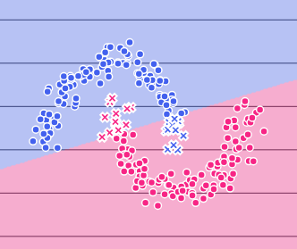
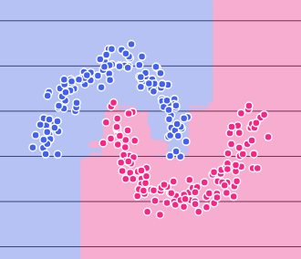
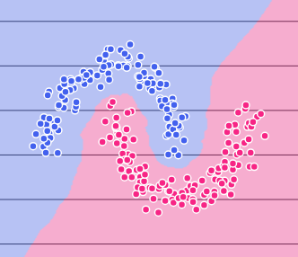
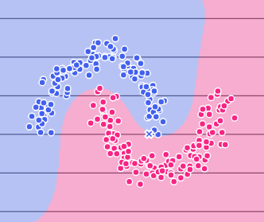
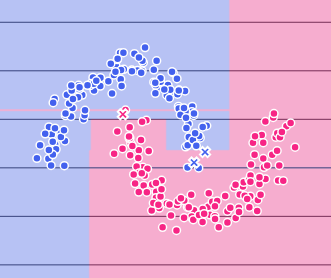

<div align="center">

# 🧪 Machine Learning Playground

### *Experiment. Visualize. Understand.*

**An interactive, browser-based sandbox for exploring machine learning classifiers — visualize decision boundaries form in real-time, diagnose bias/variance trade-offs, tune hyperparameters, and generate reproducible code.**

<br>

[](https://www.python.org/)
[](https://streamlit.io/)
[](https://scikit-learn.org/)
[](https://plotly.com/)

</div>

---

## 📌 Overview

**Machine Learning Playground** is a full-featured educational and diagnostic platform built with Python, Streamlit, and Plotly. It empowers students, educators, and ML practitioners to experiment with **10+ classification algorithms** with zero boilerplate.

Instead of running repetitive Jupyter notebook cells, you can dynamically modulate regularizations, kernels, tree depths, and voting strategies through an intuitive, dark-terminal web interface. The app provides immediate visual and statistical feedback — displaying decision surfaces, confusion matrices, ROC/PR curves, and 5-fold cross-validated learning curves.

---

## ✨ Key Features

- **🧠 10+ Supported Classifiers**:
  - **Linear Models**: Logistic Regression (with Ridge/Lasso/ElasticNet penalty solvers), Linear Discriminant Analysis (LDA).
  - **Instance-Based**: K-Nearest Neighbors (KNN with distance metrics and custom weightings).
  - **Tree & Ensembles**: Decision Trees, Random Forests, Gradient Boosting, AdaBoost.
  - **Kernel Methods**: Support Vector Machines (Linear, RBF, Polynomial, Sigmoid kernels with support vector highlighting).
  - **Probabilistic & Meta**: Gaussian Naive Bayes, Soft/Hard Voting Ensembles.
- **🗺️ Interactive Decision Boundary Rendering**:
  - Dense 2D meshgrid contour predictions rendered with hardware-accelerated Plotly graphs.
  - Soft probability heatmaps for probabilistic estimators.
  - **High-Dimensional 2D Slice Projections**: Visualizes multi-feature datasets (>2 features) along any 2 chosen axes while conditioning non-visualized dimensions at their median values.
- **📈 Comprehensive Diagnostic Suite**:
  - **Metrics**: Train vs. Test comparison (Accuracy, F1-Score, Precision, Recall, and training latency in ms).
  - **Performance Curves**: Interactive Confusion Matrix, Multi-class One-vs-Rest (OvR) ROC-AUC, and Precision-Recall (PR) curves.
  - **Bias-Variance Diagnosis**: 5-fold cross-validated Learning Curves with confidence bands and automated underfitting/overfitting heuristics.
  - **Validation Curves**: Single-parameter sweep curves to discover optimal regularization hyperparameters.
  - **Model Interpretability**: Gini/Gain feature importances for tree-based models and coefficient weights for linear classifiers.
- **🎲 Rich Datasets**:
  - **Synthetic Datasets**: Moons, Circles, Blobs, Anisotropic Blobs, XOR, and Linearly Separable data with customizable noise, sample size, and random seeds.
  - **Real Benchmarks**: Standard Scikit-Learn datasets (*Iris, Wine, Breast Cancer*).
- **⚡ Instant Code Synthesis**:
  - Generates self-contained, standalone Python scripts reproducing the exact data pipeline, preprocessing steps, and model hyperparameters configured in the UI.
- **💻 Dark Terminal UI**:
  - Custom JetBrains Mono typography, responsive layouts, and modern glassmorphic accents.

---

## 🖼️ Decision Boundary Gallery

See how different algorithms partition the feature space on identical datasets:

<div align="center">

| Logistic Regression | Random Forest | K-Nearest Neighbors |
| :---: | :---: | :---: |
|  |  |  |
| *Linear boundary; fast & interpretable* | *Ensemble partitions; high variance capacity* | *Local non-parametric neighborhoods* |

<br>

| Support Vector Machine (RBF) | Decision Tree |
| :---: | :---: |
|  |  |
| *Maximally-margined non-linear dual space* | *Axis-aligned orthogonal splits* |

</div>

---

## 🏗️ Architecture & Engineering Design

The project uses clean separation of concerns and software design patterns:

```
ml-playground/
├── app.py                  # Streamlit entrypoint & global CSS styling
├── pages/
│   ├── home.py             # Landing page, architecture overview & quickstart
│   ├── dataset.py          # Data ingestion, synthetic generators & train/test split
│   └── model.py            # Model training, hyperparameter controls & diagnostics
├── models/
│   ├── registry.py         # Config-driven metadata registry for all models & parameters
│   ├── builder.py          # Factory builder pattern with StandardScaler pipeline wrapping
│   └── evaluator.py        # Headless evaluation engine returning structured EvalResult dataclasses
├── datasets/
│   ├── synthetic.py        # Generators for non-linear & multi-cluster synthetic datasets
│   └── real.py             # Loaders and schema extraction for benchmark datasets
├── utils/
│   ├── boundary_plot.py    # Meshgrid generation & 2D slice hyperplane projections
│   ├── insights.py         # Learning curve & validation curve CV computation
│   ├── code_export.py      # Standalone Python script generator
│   └── plot_utils.py       # Scatter plot visualizers for datasets
└── assets/                 # Static visual assets and preview images
```

- **Registry Pattern (`models/registry.py`)**: Models and their hyperparameter UI types, defaults, and boundary conditions are stored as declarative metadata dictionaries, making adding new algorithms effortless.
- **Factory / Builder Pattern (`models/builder.py`)**: Automatically manages solver-penalty couplings (e.g. ElasticNet compatibility with `saga`) and wraps scale-sensitive models in `StandardScaler` pipelines.
- **Decoupled Evaluation (`models/evaluator.py`)**: Computes evaluation metrics in an isolated dataclass, keeping Streamlit pages purely focused on rendering.

---

## 🚀 Quickstart & Installation

### **Prerequisites**
- Python 3.9 or higher

### **1. Clone the repository**
```bash
git clone https://github.com/Ashrafkkhan/ML-Visualisation.git
cd ML-Visualisation
```

### **2. Set up a virtual environment (Recommended)**
```bash
# Windows (PowerShell)
python -m venv venv
.\venv\Scripts\Activate.ps1

# macOS / Linux
python3 -m venv venv
source venv/bin/activate
```

### **3. Install dependencies**
```bash
pip install -r requirements.txt
```

### **4. Launch the application**
```bash
streamlit run app.py
```
*The app will automatically launch in your default web browser at `http://localhost:8501`.*

---

## 🎮 How to Use

1. **Step 1: Choose or Generate Data (`Dataset` page)**
   - Select either **Synthetic** or **Real (sklearn)**.
   - Adjust sample count, noise ratio, and train/test split ratio.
2. **Step 2: Train & Tune (`Train Model` page)**
   - Select any classification model from the sidebar.
   - Adjust hyperparameters using sliders and dropdowns.
   - Click **Train Model** to run real-time fitting (~10–50 ms).
3. **Step 3: Analyze Diagnostics**
   - Compare train vs. test metrics to inspect generalization error.
   - Examine the **Confusion Matrix**, **ROC-AUC**, and **Precision-Recall** curves.
   - Switch to **Model Insights** to view Feature Importances, 5-Fold Learning Curves, and Validation Curves.
4. **Step 4: Inspect the Decision Boundary**
   - Toggle **Probability shading** or **Support vectors** (for SVM).
   - If using a dataset with >2 features, pick which two feature axes to project into a 2D slice.
5. **Step 5: Export Reproducible Code**
   - Scroll to **Export Code** to copy a clean, standalone Python snippet replicating your exact configuration.

---

## 🛠️ Tech Stack

| Component | Technology | Purpose |
| :--- | :--- | :--- |
| **Frontend Framework** | [Streamlit](https://streamlit.io/) | Interactive web UI, reactive session state, navigation |
| **Machine Learning** | [scikit-learn](https://scikit-learn.org/) | Classifiers, Pipelines, Metrics, Preprocessing |
| **Interactive Plotting** | [Plotly](https://plotly.com/) | Hardware-accelerated decision boundaries & metric plots |
| **Numerical Processing** | [NumPy](https://numpy.org/) | Meshgrid coordinates, matrix indexing, slice projections |
| **Data Manipulation** | [Pandas](https://pandas.pydata.org/) | Dataset framing, tabular statistics |

---

## 🤝 Contributing

Contributions are warmly welcomed! To contribute:

1. Fork the Project
2. Create your Feature Branch (`git checkout -b feature/AmazingFeature`)
3. Commit your Changes (`git commit -m 'Add some AmazingFeature'`)
4. Push to the Branch (`git push origin feature/AmazingFeature`)
5. Open a Pull Request

---

<div align="center">
  <sub>Built for interactive ML intuition. If you found this useful, please consider giving it a ⭐!</sub>
</div>
